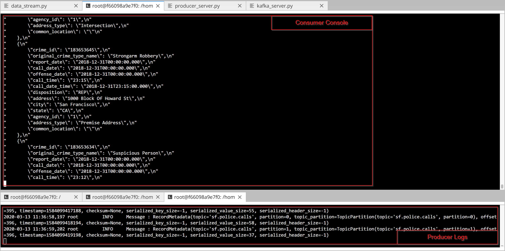

# DSND Project2-SF Crime Statistics
 
## Introduction

This project gives an overview of Apache Spark. A Kafka server is used to produce some data related to San Francisco crime statistics. A Consumer is appropriately configured to feed Spark Structured Streaming. Spark is so used to aggregate the data and extract count on a hourly basis.

## Execution
Running everythong in the Udacity Workspace, the following commands need to be used.
Install all the requirement in the `requirements.txt`by running the command:
`./start.sh`

Start the Zookeeper server:

`/usr/bin/zookeeper-server-start config/zookeeper.properties`
 
 Start the Kafka server (configured to port 9092):
 
`/usr/bin/kafka-server-start config/server.properties`

By running the following command the producer will start to feed the topic

`python kafka_server.py`

The console consumer can be used to visualize the messages sent to the topic `sf.police.calls` by the producer:

`kafka-console-consumer --bootstrap-server localhost:9092 --topic sf.police.calls --from-beginning`

The resulting output is shown in the picture below:

