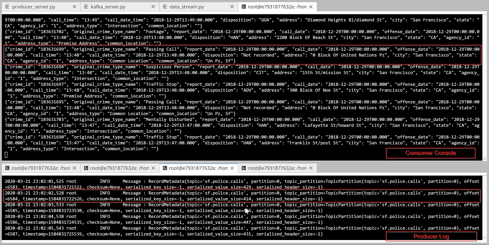
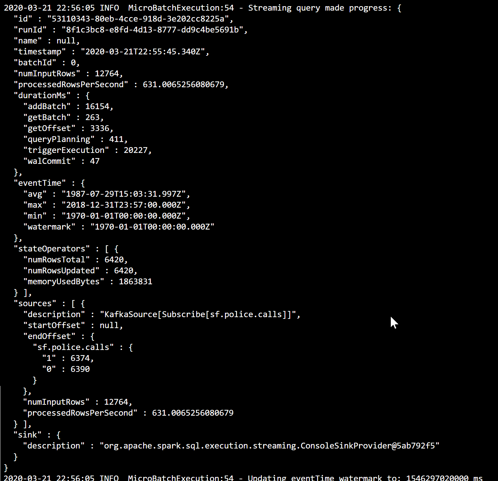
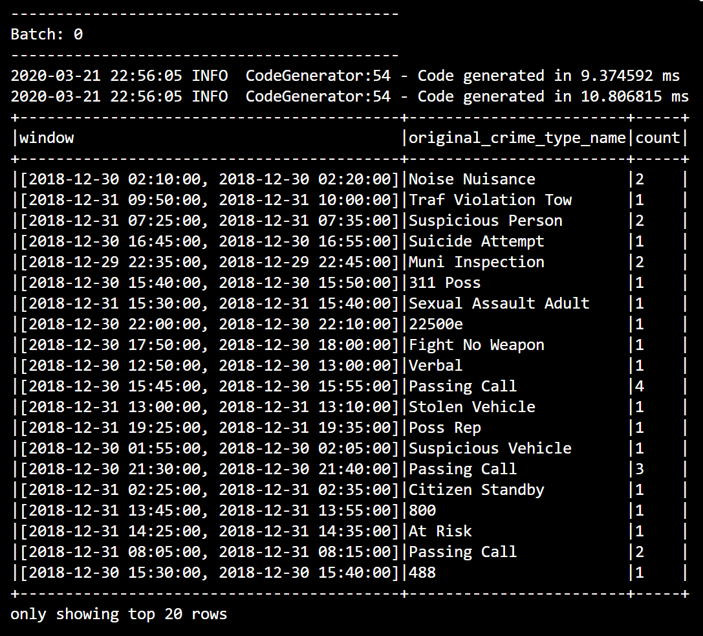

# DSND Project2-SF Crime Statistics
 
## Introduction

This project gives an overview of Apache Spark. A Kafka server is used to produce some data related to San Francisco crime statistics. A Consumer is appropriately configured to feed Spark Structured Streaming. Spark is so used to aggregate the data and extract count on a hourly basis.

## Execution
Running everythong in the Udacity Workspace, the following commands need to be used.
Install all the requirement in the `requirements.txt`by running the command:
`./start.sh`

Start the Zookeeper server:

`/usr/bin/zookeeper-server-start config/zookeeper.properties`
 
Start the Kafka server (configured to port 9092):
 
`/usr/bin/kafka-server-start config/server.properties`

By running the following command the producer will start to feed the topic:

`python kafka_server.py`

The console consumer can be used to visualize the messages sent to the topic `sf.police.calls` by the producer:

`kafka-console-consumer --bootstrap-server localhost:9092 --topic sf.police.calls --from-beginning`

The resulting output is shown in the picture below:

As the produce works fine, let's submit the spark streaming job:

`spark-submit --packages org.apache.spark:spark-sql-kafka-0-10_2.11:2.3.4 --master local[*] data_stream.py`

Spark start the execution an produce the following progress report at the first batch:

the resulting table of counted police call:

## Efficiency

**1. How did changing values on the SparkSession property parameters affect the throughput and latency of the data?**

**2. What were the 2-3 most efficient SparkSession property key/value pairs? Through testing multiple variations on values, how can you tell these were the most optimal?**

